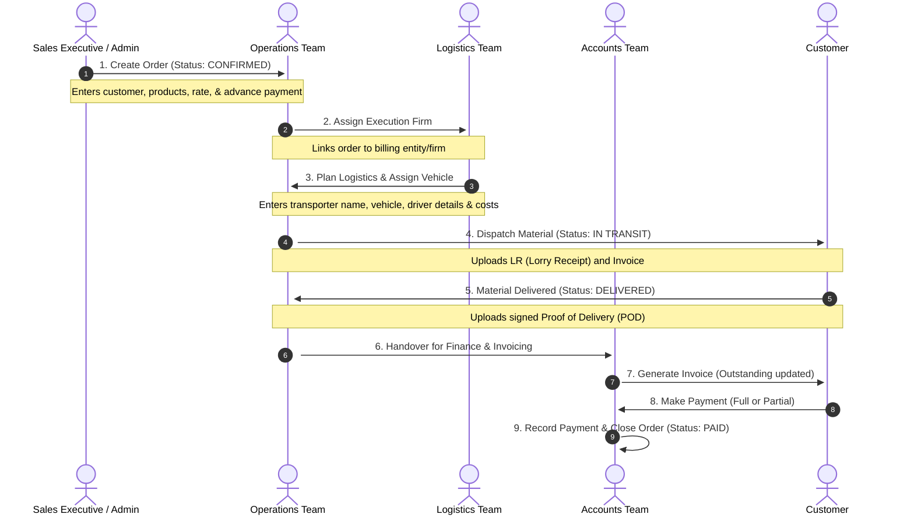

# Knowledge Transfer (KT) Document: Order Lifecycle & Workflow

This document provides a detailed walkthrough of the sequential order workflow within the **Longowal Sales, Order & Logistics Management System (OOMS)**. It describes how an order moves from creation to delivery and final payment settlement, along with the responsibilities of each user role.

---

## 🗺️ Visual Order Lifecycle (Sequence Flow)

---

## 🔄 Step-by-Step Order Stages

### Stage 1: Order Booking / Creation
* **Primary Actors:** Sales Executive, Admin
* **Initial Status:** `CONFIRMED` (or `DRAFT` if saved for review)
* **What happens:**
  1. The Sales Executive opens the **Create Order** screen.
  2. Selects the **Customer** (from database) and the **Execution Firm** responsible for billing.
  3. Enters the **Product details** (Product type, Quantity, Unit, and Rate). The system automatically calculates:
     $$\text{Total Order Value} = \text{Quantity} \times \text{Rate}$$
  4. Inputs the **Delivery details** (Delivery Location, Dispatch Point, and Expected Delivery Date).
  5. Enters **Financial details** (Advance Amount paid, which auto-calculates the remaining Balance Amount).
  6. Submits the order.

---

### Stage 2: Execution Firm Assignment
* **Primary Actors:** Operations Team, Admin
* **Status:** `CONFIRMED`
* **What happens:**
  1. The Operations team opens the pending order detail view.
  2. Selects the execution firm (e.g., *Longowal Logistics & Execution Ltd*) if not pre-assigned, ensuring correct tax billing (GSTIN matching).

---

### Stage 3: Logistics Planning
* **Primary Actors:** Logistics Team, Operations, Admin
* **Status:** `CONFIRMED`
* **What happens:**
  1. The logistics manager coordinates with transporters to assign a vehicle.
  2. In the **Logistics Tab** of the Order details, the following details are logged:
     - **Transporter Name**
     - **Vehicle Number** (e.g., PB-65-XX-XXXX)
     - **Driver Name & Mobile Number**
     - **Cost Breakdown:** Freight Cost, Loading/Unloading Charges, Toll, and Miscellaneous.
  3. The system calculates the total logistics cost to monitor gross margins.

---

### Stage 4: Dispatch & Material Handover
* **Primary Actors:** Operations, Logistics Team
* **Status:** `IN TRANSIT`
* **What happens:**
  1. Once the material is loaded at the plant, the logistics team generates a **Dispatch Record**.
  2. They upload critical proof files:
     - **Lorry Receipt (LR Copy)**
     - **Plant Invoice / Gate Pass**
  3. The order status shifts to `IN TRANSIT` and the customer is notified of the dispatch.

---

### Stage 5: Delivery & Acceptance
* **Primary Actors:** Operations Team, Customer
* **Status:** `DELIVERED`
* **What happens:**
  1. When the vehicle reaches the destination, the material is unloaded.
  2. The customer signs the **Proof of Delivery (POD)**.
  3. The operations team uploads the signed POD to the **Dispatch Tab** and marks the status as `DELIVERED`.

---

### Stage 6: Invoicing
* **Primary Actors:** Accounts Team
* **Status:** `DELIVERED` (Invoice generated)
* **What happens:**
  1. The Accounts team reviews the delivered order and clicks **Create Invoice**.
  2. They enter:
     - **Invoice Number**
     - **Invoice Date & Due Date**
     - **Total Invoice Value** (including GST)
     - **Upload Invoice PDF**
  3. Saving the invoice adds the amount to the **Customer Outstanding Balance**.

---

### Stage 7: Payment Collection & Reconciliation
* **Primary Actors:** Accounts Team
* **Final Status:** `PAID` (or `PARTIAL` if balance remains)
* **What happens:**
  1. When payment is received, the Accountant records it under **Record Payment**.
  2. Enters the amount, date, mode (NEFT/RTGS, UPI, Cash), and reference number.
  3. The system dynamically updates customer outstanding:
     $$\text{Outstanding Balance} = \text{Invoice Amount} - \text{Total Amount Received}$$
  4. If Outstanding = 0, the order shifts to `PAID` and is closed.

---

## 👥 Responsibility Matrix (Who does what?)

| Module / Action | Sales Executive | Operations | Logistics | Accounts | CMD / Admin |
| :--- | :---: | :---: | :---: | :---: | :---: |
| **Create Lead / Add Followup** | ✅ | ❌ | ❌ | ❌ | ✅ |
| **Book New Order** | ✅ | ❌ | ❌ | ❌ | ✅ |
| **Assign Execution Firm** | ❌ | ✅ | ❌ | ❌ | ✅ |
| **Add Logistics Costs & Vehicle** | ❌ | ✅ | ✅ | ❌ | ✅ |
| **Create Dispatch / Upload LR** | ❌ | ✅ | ✅ | ❌ | ✅ |
| **Mark Order Delivered / POD** | ❌ | ✅ | ✅ | ❌ | ✅ |
| **Generate Invoice** | ❌ | ❌ | ❌ | ✅ | ✅ |
| **Record Payment & Adjust Ledger** | ❌ | ❌ | ❌ | ✅ | ✅ |
| **View Revenue & Reports** | ❌ | ❌ | ❌ | ❌ | ✅ (Full CMD View) |
